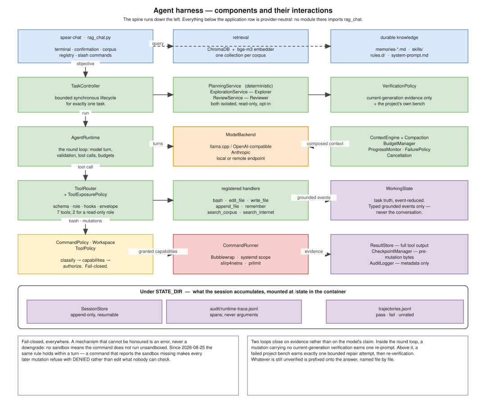
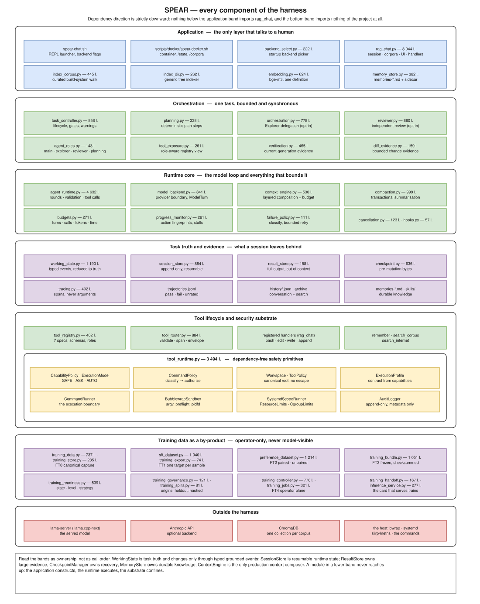

.. _architecture:

============
Architecture
============

SPEAR separates the interactive application from the provider-neutral task
runtime and from the security substrate.  The same ``AgentRuntime`` executes
the Main, Explorer and Reviewer roles; role configuration supplies isolated
contexts and structurally filtered tools.

   The components and how one turn moves through them.  The spine runs down
   the left; everything below the application row is provider-neutral.

.. code-block:: text

   CLI / application (rag_chat.py)
              |
              v
       TaskController
          |   |   |
          |   |   +---- PlanningPolicy
          |   +-------- DelegationManager
          |               +-- Explorer (isolated, read-only)
          |               +-- Reviewer (isolated, read-only)
          v
       AgentRuntime <---------------- ModelBackend
          |                            +-- local/OpenAI-compatible adapter
          |                            +-- Anthropic adapter
          +-- WorkingState
          +-- ContextEngine -- CompactionService
          +-- BudgetManager
          |
          +-- VerificationPolicy
          +-- CheckpointManager
          +-- SessionStore
          |
          v
       ToolRouter -- ToolRegistry -- ResultStore
          |
          v
       CommandRunner -- Bubblewrap

Task ownership
==============

``WorkingState`` is authoritative task truth.  It changes only through typed,
grounded events.  Conversation, retrieved context, durable memory and compacted
summaries are context sources, not alternative task-state stores.

``TaskController`` owns the bounded synchronous lifecycle: optional planning,
Main execution, verification, and checkpoint finalization by default. Explorer,
Reviewer and their bounded repair cycle are explicit experimental opt-ins. It
receives an already constructed
``AgentContext`` and injected callbacks for project bench execution, diff
evidence, child sessions, and the remaining code-block compatibility path.  It
does not read terminal input, render output, choose a provider, or construct a
filesystem persistence implementation.

Context and memory
==================

``ContextEngine`` is the only production context composer.  It accounts for
system rules, project rules, active durable memories, WorkingState projection,
conversation summaries, recent conversation, retrieval and tool evidence.

``MarkdownMemoryStore`` keeps ``memories-*.md`` as the human-editable source of
truth.  A ``.metadata.json`` sidecar adds IDs, scopes, provenance, tags,
confidence and explicit supersession.  The sidecar does not duplicate memory
content and may be deleted safely; active sessions then lose metadata
enrichment but retain every Markdown memory.  Memory selection is bounded and
lexically relevant when no semantic service is involved.  Memory never
overrides WorkingState.

Persistence ownership and retention
===================================

Persistent artifacts have distinct owners:

* ``audit/runtime-trace.jsonl`` is optional observability and may be rotated or
  deleted without affecting resume.
* ``audit/sessions/`` contains resumable state and references tool results and
  checkpoints.  Do not remove an active session's referenced evidence.
* ``audit/tool-results/`` holds full bounded-out-of-context tool evidence.
* ``audit/checkpoints/`` holds exact pre-mutation bytes for safe rollback.
* ``trajectories.jsonl`` and history files are training and user-facing
  projections, not resumable runtime state.  Recording is deliberately wider
  than judging: a turn the project's bench judged is recorded ``pass`` or
  ``fail``, and a turn nothing judged is recorded ``unrated`` rather than
  dropped.  Gating the recording on a verdict is what once left the dataset
  holding a single trajectory — one project declares a bench — so the width is
  the point, not an oversight.  ``/good`` promotes what was right.
* ``memories-*.md`` and their optional sidecars are durable project knowledge.

No automatic garbage collector currently runs.  Closed session bundles may be
archived or deleted manually as a unit after their checkpoint and result
references are no longer needed.  Deleting a trace or trajectory never repairs
or invalidates a session; deleting referenced results/checkpoints makes the
associated evidence unavailable.

Every component
===============

   The exhaustive map: the forty-nine harness modules grouped by what they
   own, with the line counts read from the tree when the diagram is
   regenerated.  Read the bands as ownership rather than as call order.

``./img/export_png.sh components`` renders the same page as a PNG for a slide
or an issue; it falls back to rasterising the SVG when the drawio CLI is
unusable, which it usually is.

Training data as a by-product
=============================

Fifteen of the modules belong to a subsystem the rest of the harness feeds
rather than calls: canonical episode capture, SFT and preference curation,
governance, readiness, the frozen bundle, and the operator control plane that
launches a job.  It sits outside the turn — nothing in it is model-visible, no
tool reaches it, and freezing a bundle executes no training.  It has its own
chapter, :doc:`/model/training`.

The coupling that does exist runs one way and is deliberate: ``AgentRuntime``
and ``TaskController`` emit trajectories, ``rag_chat`` owns the ``/finetune``
operator command, and ``training_handoff`` is allowed to stop the inference
service because on a single-GPU host the card that trains is the card that
serves.

Dependency direction
====================

Lower runtime modules do not import ``rag_chat``.  ``rag_chat`` owns backend
construction, project selection, terminal commands, human confirmation and
presentation.  ``TaskController`` depends on provider-neutral policies and
protocols; ``AgentRuntime`` does not depend on ``TaskController`` or on
Explorer/Reviewer orchestration.

Model capability boundary
=========================

``ModelBackend.complete`` remains the intentionally small required protocol.
Canonical ``ModelTurn`` carries stop reason and optional usage, while context
and output limits are explicit ``AgentContext`` configuration.  Cancellation
is checked immediately before and after calls for every backend.  No mandatory
capability object was added during consolidation: the current adapters cannot
truthfully promise transport-level cancellation or exact token counting, and
making those flags mandatory would couple the runtime to provider behavior.
Future adapters may expose optional native capabilities without changing the
canonical turn contract.

Default profile
===============

Normal CLI tasks use the Main runtime only. Planning remains deterministic and
conservative; Explorer, Reviewer and reviewer repair are disabled unless the
caller explicitly enables them. This avoids paying for child contexts whose
structured contracts were not reliable in the measured local-model runs while
retaining their isolated role architecture for experiments and future models.
