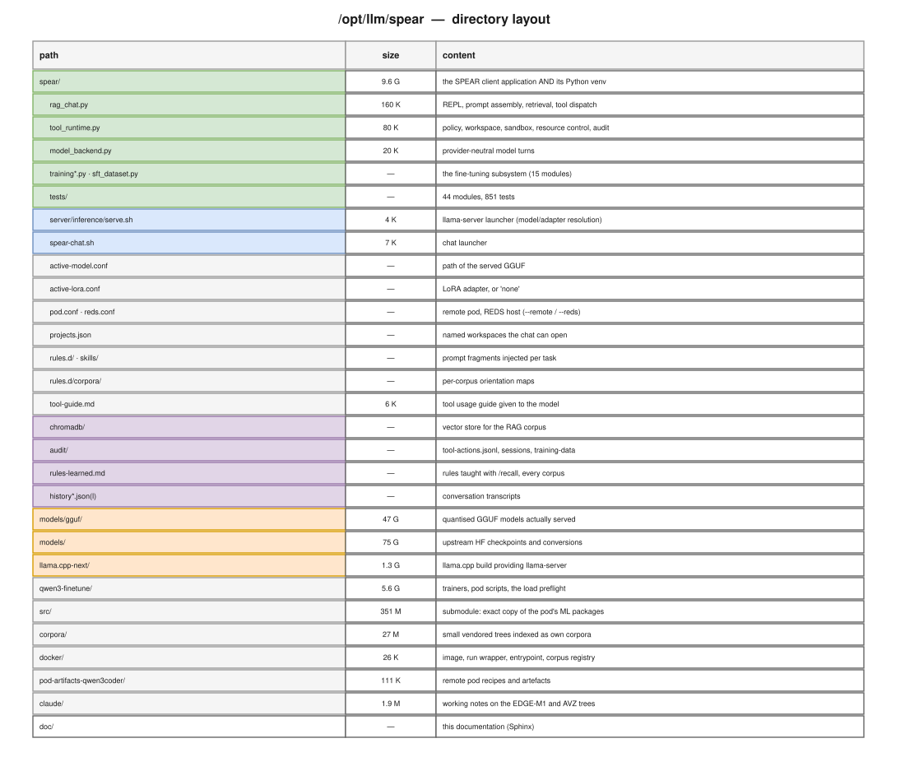

================
Directory layout
================

Everything lives under ``/opt/llm/spear``.  The tree mixes three quite different
kinds of content — application code, multi-gigabyte model weights, and
persistent state — so it is worth knowing which is which before running a
``find`` over it.

   ``/opt/llm/spear`` at a glance: application, models, state.

Top level
=========

.. list-table::
   :header-rows: 1
   :widths: 26 10 64

   * - Path
     - Size
     - Content
   * - ``spear/``
     - 9.6 G
     - The application **and** its Python virtualenv.  ``bin/python`` here is
       the interpreter every command in this documentation uses.
   * - ``models/gguf/``
     - 47 G
     - Quantised GGUF files that are actually served.
   * - ``models/``
     - 75 G
     - Upstream Hugging Face checkpoints and intermediate conversions.
   * - ``docker/``
     - 40 K
     - Everything about the container image: ``Dockerfile``, the build and run
       wrappers, the entrypoint and the relative-path corpus registry.  It sits
       at the root rather than under ``spear/`` because it draws on both
       (:doc:`container`).
   * - ``llama.cpp-next/``
     - 1.3 G
     - The ``llama.cpp`` checkout and build providing ``llama-server``.
   * - ``qwen3-finetune/``
     - 5.6 G
     - The fine-tuning working area: LoRA trainers, pod and reds-ml scripts,
       corpus builders and the load preflight.  The *governed* training path
       lives in the application instead (:doc:`training`).
   * - ``src/``
     - 351 M
     - **Git submodule** (``llm/spear-src``).  An exact rsync of the ML
       packages installed on the QLoRA pod, kept for reading: ``transformers``
       5.13.0.dev0, ``peft`` 0.19.1, ``torch``, and a ``pytorch`` 2.11.0a0
       checkout.  It is a separate repository rather than a set of upstream
       submodules because three of the four are *installed package* trees, not
       repository checkouts, and no exact upstream revision is known.  Clone
       with ``git clone --recurse-submodules``, or run
       ``git submodule update --init`` afterwards.
   * - ``pod-artifacts-qwen3coder/``
     - 111 K
     - Recipes and artefacts for the remote GPU pod.
   * - ``corpora/``
     - 27 M
     - Small vendored trees indexed as their own corpora (``musl-headers``,
       ``posix-api``) — they answer questions no product tree contains.
   * - ``claude/``
     - 1.9 M
     - Working notes on the EDGE-M1 and AVZ trees, kept as Markdown.
   * - ``doc/``
     - —
     - This documentation.

.. note::

   ``spear`` being both the application directory and the virtualenv root
   is why ``bin/``, ``lib/`` and ``include/`` sit next to ``rag_chat.py``.
   It is unusual but deliberate: the app and its exact dependency set travel
   together.

The application
===============

.. list-table::
   :header-rows: 1
   :widths: 30 70

   * - File
     - Role
   * - ``rag_chat.py``
     - Application/REPL startup, project selection, retrieval helpers, concrete
       tool handlers, compatibility commands, history projection and rendering.
   * - ``task_controller.py`` / ``agent_runtime.py``
     - UI-free task orchestration and the reusable provider-neutral model/tool
       execution loop.
   * - ``working_state.py`` / ``context_engine.py`` / ``compaction.py``
     - Grounded task truth and bounded layered model context.
   * - ``memory_store.py``
     - Structured selection and metadata over compatible Markdown memories.
   * - ``tool_registry.py`` / ``tool_router.py`` / ``result_store.py``
     - Declarative tool exposure, structured lifecycle and retained evidence.
   * - ``tool_runtime.py``
     - The execution harness: policy, workspace, sandbox, resource control,
       audit.  Deliberately imports nothing from ``rag_chat``, so it can be
       tested in isolation.
   * - ``model_backend.py``
     - Provider-neutral model turns.  Normalises OpenAI-compatible and
       Anthropic responses into one ``ModelTurn`` type with a strict
       ``stop_reason`` contract.
   * - ``index_corpus.py`` / ``index_dir.py``
     - Corpus ingestion into Chroma.
   * - ``training*.py`` / ``sft_dataset.py`` / ``preference_dataset.py``
     - The fine-tuning subsystem: capture, curation, governance, readiness,
       frozen bundles and the operator control plane.  Fifteen modules, none
       of them model-visible (:doc:`training`).
   * - ``inference_service.py`` / ``remote_readiness.py``
     - Operator-only control of the serving process, and what a training host
       is missing.  Used by the single-GPU handoff.
   * - ``backend_select.py``
     - The startup backend picker.  Writes ``active-backend.conf``.
   * - ``tests/``
     - Forty-four test modules, 851 tests.  ``test_tool_runtime.py`` is the
       largest; see :doc:`testing`.

Configuration
=============

.. list-table::
   :header-rows: 1
   :widths: 30 70

   * - File
     - Meaning
   * - ``active-model.conf``
     - Absolute path of the GGUF to serve.  Read by ``server/inference/serve.sh``;
       ``SPEAR_MODEL`` in the environment overrides it.
   * - ``active-lora.conf``
     - LoRA adapter path, or the literal ``none``.  ``SPEAR_LORA`` overrides.
   * - ``pod.conf``
     - Connection details for the remote vLLM pod used by
       ``spear-chat --remote``.  The SSH port changes on every pod restart.
   * - ``reds.conf``
     - Host, port and model for the REDS server (RTX PRO 6000) used by
       ``spear-chat --reds``.  Stable host: the launcher only tunnels to it.
   * - ``machine.env``
     - Settings specific to THIS machine, untracked: the ``SPEAR_*`` path
       overrides a deployment needs and nothing a clone should inherit.  Every
       ``spear-*`` launcher sources it if it is there, and runs on the defaults
       if it is not.
   * - ``active-backend.conf``
     - The backend chosen last, preselected by the startup picker.  Runtime
       state, not versioned.
   * - ``projects.json``
     - Named workspaces the chat can open, mapping a short name to an absolute
       path and a project kind.
   * - ``system-prompt.md``
     - The base system prompt.
   * - ``tool-guide.md``
     - The tool usage guide handed to the model.
   * - ``rules.d/``
     - Prompt fragments injected per task kind.  ``rules.d/corpora/<name>.md``
       holds a corpus's orientation map (:doc:`retrieval`).
   * - ``skills/``
     - Task recipes (build debugging, rootfs packages, code quality…), each
       optionally opening with a ``SKILL.md`` frontmatter block read by
       ``skill_library.py`` (:doc:`retrieval`).

.. _resource-directories:

Content the deployment owns
===========================

``rules.d/``, ``skills/`` and ``benches/`` are *content*, not code — and a
deployment's own rules, its learned skills and the bench that rates it are
exactly the material that does not belong in a public tree.  Each therefore
answers to an environment variable:

.. list-table::
   :header-rows: 1
   :widths: 26 30 44

   * - Variable
     - Default
     - What it holds
   * - ``SPEAR_RULES_DIR``
     - ``<app>/rules.d``
     - the always-injected rules, and ``corpora/<name>.md`` under it
   * - ``SPEAR_SKILLS_DIR``
     - ``<app>/skills``
     - the skill library, read *and written* — ``save_skill`` lands here
   * - ``SPEAR_BENCH_DIR``
     - ``<app>/benches``
     - the acceptance benches a project declares by bare name

The default is the in-tree directory, so a plain checkout behaves exactly as it
did; **no default points outside the checkout**, which is what keeps a private
path out of public source.  An empty value counts as unset rather than naming
the filesystem root.

The failure mode these replace is quiet: ``load_rules()`` returns ``""`` for a
directory that is not there and the skill library returns ``[]``, so a session
whose content had moved ran with none of it and said nothing.  The same three
variables are read by ``docker/build.sh`` when it bakes an image
(:ref:`optional-build-inputs`), so one setting covers both.

Persistent state
================

.. list-table::
   :header-rows: 1
   :widths: 30 70

   * - Path
     - Content
   * - ``chromadb/``
     - The vector store.  Rebuildable from the sources it indexes.
   * - ``audit/tool-actions.jsonl``
     - Append-only audit trail of mutating tool attempts.  Metadata only:
       assignments that look like secrets are redacted before the record is
       written.
   * - ``audit/runtime-trace.jsonl``
     - Optional privacy-bounded runtime observability.
   * - ``audit/sessions/`` / ``audit/tool-results/`` / ``audit/checkpoints/``
     - Resumable task snapshots, referenced large results, and pre-mutation
       rollback bytes. Active sessions may reference the latter two.
   * - ``audit/training-data/``
     - Canonical training episodes, the source a bundle freezes from.
   * - ``rules-learned.md``
     - Rules taught at runtime with ``/recall``.  Injected into every session,
       under a token budget.
   * - ``memories-*.md`` / ``memories-*.md.metadata.json``
     - Human-readable durable knowledge and optional structured enrichment.
   * - ``history*.json`` / ``history-archive.jsonl``
     - Conversation transcripts, including per-project ones.
   * - ``llama-server.log``
     - Server log for the currently running unit.

.. _entry-points:

Entry points
============

These are on ``PATH`` (via ``~/.local/bin``):

``spear-chat``
   The interactive assistant.  ``--remote`` routes to the vLLM pod described
   by ``pod.conf`` instead of the local server.  ``spear-chat --help`` lists
   every flag — permissions, model, corpus — and is answered before any
   server is started or any corpus resolved, so it costs nothing.

   It invokes the venv interpreter by path rather than sourcing
   ``bin/activate``: a virtualenv hardcodes its own absolute path, so a
   relocated tree activates into a directory that no longer exists and
   ``python3`` silently falls through to the system interpreter.

``spear-server``
   Starts ``llama-server`` with the active model profile.  It runs as the
   transient systemd unit ``spear-llm.service`` in ``system.slice`` — note
   that this places the model server **outside** the tool cgroups entirely,
   which is what makes it immune to a runaway tool call.

``spear-model``
   Switches the active model or LoRA adapter, i.e. rewrites
   ``active-model.conf`` / ``active-lora.conf``.

``spear-docker``
   The same assistant in a container.  It takes ``spear-chat``'s arguments and
   adds the mounts, the tunnel and the working-directory translation
   (:doc:`container`).

``spear-corpus``
   Manages the ``projects.json`` registry: ``add`` a tree, or ``scan`` a
   workspace into per-component corpora by file count.  A wrapper around
   ``rag_chat.handle_corpus_command``, which is also what ``/corpus`` calls
   inside the chat: one registry deserves one implementation — and one
   environment, so it reads ``machine.env`` exactly as ``spear-chat`` does.
   Without that the CLI resolved relative corpus paths against a different
   root than the session that would later read them.
   A deprecated alias existed before the rename; it was retired with the
   old command names.

``spear-stop``
   Stops ``spear-llm`` and frees the RAM it holds.  The next ``spear-chat``
   starts it again.

.. _doc-diagrams:

This documentation
==================

::

   doc/
     Makefile                       make html | latexpdf | diagrams | …
     requirements.txt               pinned Sphinx toolchain (local and CI)
     source/
       conf.py                      Sphinx configuration
       *.rst                        the chapters
       _static/theme_overrides.css  small readability overrides
       img/
         gen_spear_diagrams.py      generator: writes the .drawio AND the SVGs
         spear.drawio               editable multi-page source of truth
         spear_<page>.svg           rendered diagrams used by the HTML build
         export_png.sh              optional PNG export (see the caveat below)

To change a diagram, edit ``gen_spear_diagrams.py`` and run ``make diagrams``.
The ``.drawio`` file can also be opened and edited directly in draw.io or the
VS Code extension — it is a normal multi-page drawio document, one page per
diagram — but a subsequent ``make diagrams`` regenerates it from the Python
description, so keep structural changes in the generator.

.. warning::

   ``export_png.sh`` depends on the ``drawio`` CLI, which on this machine
   (snap 30.4.1) fails on **every** input with
   ``ReferenceError: next is not defined`` raised from its own
   ``electron.js`` — including a five-element minimal file and the SO3
   documentation's diagrams.  That is why the SVGs are rendered directly by
   the generator instead: the documentation build does not depend on the
   broken CLI.  The script is kept for environments with a working drawio.

Building
========

.. code-block:: console

   $ cd /opt/llm/spear/doc
   $ make diagrams      # only if a diagram changed
   $ make html
   $ xdg-open build/html/index.html

Sphinx and the RTD theme come from the system Python (``/usr/bin/sphinx-build``),
not from the ``spear`` virtualenv, which deliberately carries only the
application's runtime dependencies.  ``doc/requirements.txt`` pins the versions
for anyone who prefers an isolated environment:

.. code-block:: console

   $ pip install -r doc/requirements.txt

The same file is what ``.github/workflows/docs.yml`` installs.  That workflow
builds these pages on every push to ``main`` and publishes them to GitHub
Pages, so the published site is always the documentation of the current
``main``; a pull request builds the documentation but never publishes it.  The
build must stay dependency-free with respect to the application — the
documentation imports no project module, which is why a Sphinx toolchain and a
checkout are the whole of what CI needs.
