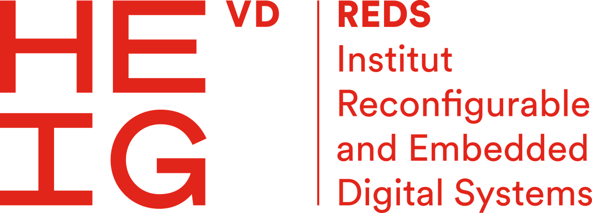

.. SPEAR documentation master file.

.. toctree::
   :maxdepth: 2
   :numbered:
   :hidden:
   :caption: The platform

   introduction
   architecture
   installation
   Getting started <getting_started>

.. toctree::
   :maxdepth: 2
   :numbered:
   :hidden:
   :caption: Using SPEAR

   spear-chat <usage>
   projects
   retrieval
   Container <container>

.. toctree::
   :maxdepth: 2
   :numbered:
   :hidden:
   :caption: Evidence-grounded reasoning

   standards
   workflow
   guards
   context

.. toctree::
   :maxdepth: 2
   :numbered:
   :hidden:
   :caption: Execution and serving

   harness/harness
   model/model
   backends

.. toctree::
   :maxdepth: 2
   :numbered:
   :hidden:
   :caption: Reference

   configuration
   directory_layout
   troubleshooting
   testing
   operations
   Coding conventions <coding_conventions>
   Development flow <dev_flow>
   glossary

|

======================================================================
SPEAR — Specification-driven Platform for Embedded Agentic Reasoning
======================================================================

SPEAR combines authoritative specifications, project source code and
controlled agentic workflows to support evidence-grounded engineering.

It exists for a specific kind of task: one where an agent must reason from an
**authoritative technical source**, inspect an **implementation**, make
**controlled changes** to it, and retain the **evidence** for every conclusion
it reports.

That is not the same problem as writing code. A specified system has two
sources of truth, and they are not interchangeable — the specification says
what is required, the implementation says what the code does. An answer that
takes the first from the second is wrong even when every sentence in it is
true of the code. SPEAR keeps the two roles distinct, and will withhold an
answer rather than close the gap with a guess.

.. figure:: img/spear_overview.svg
   :width: 100%

   Entry points, the platform core, model serving and the confined tool
   execution path.

What SPEAR does
===============

**Authoritative-source grounding**
    A specification is ingested once and bound to the machine. On a turn that
    asks what the document defines, the document is read *first*, and every
    normative claim in the answer carries the provision it rests on.

**Codebase-aware reasoning**
    Registered source trees are indexed and retrieved from, so questions about
    a project are answered from that project rather than from the model's
    recollection of projects like it.

**Controlled code modification**
    A change runs through investigation, planning, editing, testing and
    review. A file becomes writable because a planned item named it — not
    because the agent decided to open it.

**Validation-aware workflows**
    How a behaviour will be proved is decided before the code that implements
    it is written, which is what makes the test a check rather than a
    description.

**Traceable evidence and citations**
    What each turn retrieved, what it read and what it ran is recorded. The
    closing report is generated from that record, not from the agent's own
    summary of its work.

**Multiple model backends**
    Any OpenAI-compatible endpoint, local or remote, and the Anthropic API.
    Everything below the application layer is provider-neutral.

**Confined execution**
    One rule governs the whole execution path: **fail-closed** — a confinement
    that cannot be applied is an error, never a silent downgrade.

Where to start
==============

:ref:`Introduction <introduction>` · :ref:`Architecture <architecture>`
    What the platform is, what it is not, and how its parts fit together.

:ref:`Installation <installation>` · :ref:`Getting started <getting_started>`
    Prerequisites, the native and container paths, and a first useful session.

:ref:`spear-chat <usage>` · :ref:`Projects and corpora <projects>`
    The command line, the in-session commands, and how a tree becomes
    something SPEAR can reason about.

:ref:`Authoritative standards <standards>`
    The defining feature: binding a specification, what normative evidence is,
    and why an implementation comment is not authority.

:ref:`The engineering workflow <workflow>` · :ref:`Evidence and guards <guards>`
    How a change is made under control, and why an answer is sometimes
    withheld or reported incomplete.

:ref:`Configuration reference <configuration>` · :ref:`Troubleshooting <troubleshooting>`
    Every supported setting, and what the common symptoms actually mean.

Project
=======

SPEAR is developed at the `REDS institute <https://reds.heig-vd.ch>`_ of
`HEIG-VD <https://www.heig-vd.ch>`_, and is published under the Apache License
2.0.

To edit this documentation, follow the conventions in ``doc/README`` and the
`Sphinx style guide
<https://documentation-style-guide-sphinx.readthedocs.io/en/latest/style-guide.html>`_.
