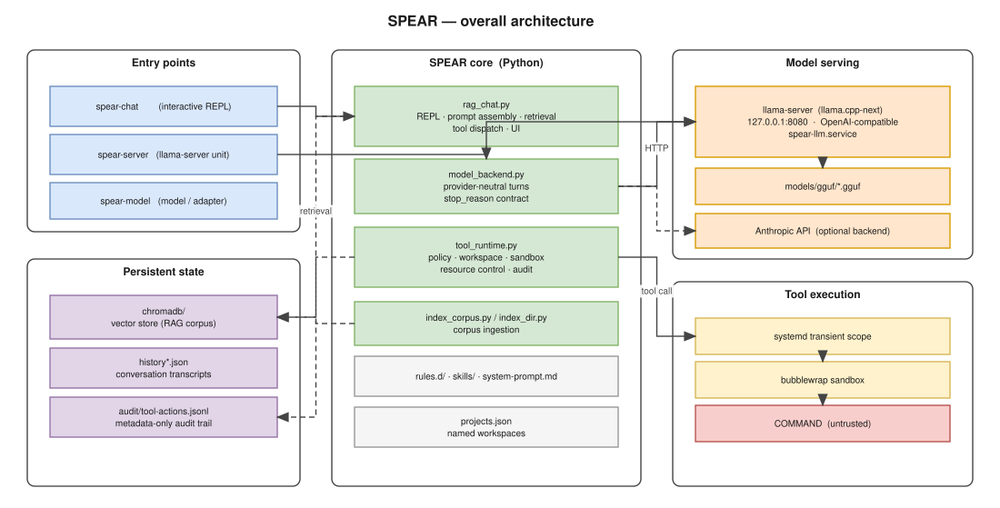

.. SPEAR documentation master file.

====================================================================
SPEAR — Specification-driven Platform for Embedded Agentic Reasoning
====================================================================

SPEAR is the local, self-hosted assistant infrastructure that lives under
``/opt/llm/spear``.  It serves a quantised Qwen model from a GPU/CPU hybrid
``llama-server``, augments it with a retrieval corpus built from the source trees you
register, and — the part this documentation spends most of its pages
on — lets that model run real commands on the machine behind a
deliberately paranoid execution harness.

The guiding principle throughout is **fail-closed**: every mechanism that
cannot be honoured is an error, never a silent downgrade to a less confined
execution.  A model that asks for something the harness cannot confine gets a
refusal, not a shortcut.

   Overall architecture: entry points, the Python core, model serving and the
   confined tool execution path.

.. toctree::
   :maxdepth: 2
   :numbered:
   :caption: Contents

   introduction
   directory_layout
   architecture
   final_harness_audit
   model_serving
   retrieval
   tool_harness
   security_model
   sandbox
   network
   resource_control
   testing
   training
   operations
   container

Reading order
=============

If you are new to the project, read :doc:`introduction` and
:doc:`directory_layout` first: together they explain what runs where.

If you are here for the execution harness — the reason this documentation
exists — the spine is :doc:`tool_harness`, then :doc:`security_model` for the
authorization rules, then :doc:`sandbox`, :doc:`network` and
:doc:`resource_control` for the three confinement layers, in increasing order
of subtlety.

If you are debugging a failure, :doc:`operations` lists the observable states
and where each one is reported.

If you are here for the fine-tuning side — how the harness turns its own usage
into a governed dataset, and what it takes to run a job on the card that also
serves the model — that is :doc:`training`, and it stands on its own.

If you are handing the assistant to someone else, :doc:`container` is the whole
story: what the image carries, what it expects mounted, and the two run flags
without which the harness refuses every command.

Diagrams
========

Every diagram in this documentation is a page of a single editable drawio
file, ``source/img/spear.drawio``.  That file is itself generated from
``source/img/gen_spear_diagrams.py``, so a structural change is made once, in
Python, rather than by hand in several boxes.  See :ref:`doc-diagrams` for the
regeneration workflow.

Indices and tables
==================

* :ref:`genindex`
* :ref:`search`
