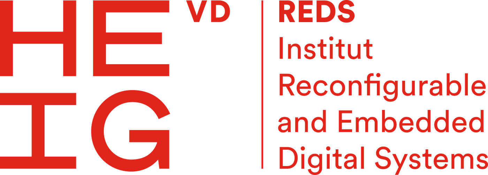

.. SPEAR documentation master file.

.. toctree::
   :maxdepth: 3
   :numbered:
   :hidden:

   overview/index
   start/index
   using/index
   reasoning/index
   harness/harness
   model/model
   operations/index
   contributing/index

|

.. rst-class:: center

Specification-driven Platform for Embedded Agentic Reasoning
############################################################

|

.. rst-class:: left

Overview
********

SPEAR is an engineering agent for specified systems. It keeps apart the agent
that changes code, the control plane that confines it, the evidence of what it
did, the normative reasoning about a bound standard, and the compliance
evidence that judges a change — and computes its verdicts from that evidence on
the final source state.

- :ref:`Overview <part_overview>`: :ref:`Introduction <introduction>`, :ref:`Architecture <architecture>`, :ref:`Glossary <glossary>`

.. rst-class:: left

Getting started
***************

- :ref:`Getting started <part_start>`: :ref:`Quick start <getting_started>`, :ref:`Installation <installation>`, :ref:`Containerised environment <container>`

.. rst-class:: left

Using SPEAR
***********

- :ref:`Using SPEAR <part_using>`: :ref:`spear-chat <usage>`, :ref:`Projects and corpora <projects>`, :ref:`Retrieval <retrieval>`, :ref:`Configuration reference <configuration>`

.. rst-class:: left

Request modes and evidence
**************************

- :ref:`Request modes and evidence <part_reasoning>`: :ref:`Implementation mode <implementation_mode>`, :ref:`Normative mode <standards>`, :ref:`Mixed mode <mixed_mode>`, :ref:`Evidence and verdicts <evidence_verdicts>`, :ref:`Normative answer guards <guards>`, :ref:`The bound-session change workflow <workflow>`

.. rst-class:: left

The confined execution path
***************************

- :ref:`The confined execution path <harness>`

.. rst-class:: left

The model and its weights
*************************

- :ref:`The model and its weights <model>`

.. rst-class:: left

Operations and reference
************************

- :ref:`Operations and reference <part_operations>`: :ref:`Operations <operations>`, :ref:`Troubleshooting <troubleshooting>`, :ref:`Testing <testing>`

.. rst-class:: left

Contributing
************

- :ref:`Contributing <part_contributing>`: :ref:`Coding conventions <coding_conventions>`, :ref:`Development flow <dev_flow>`, :ref:`Release process <release_process>`

To edit the documentation and to use the correct underlying policy, you can read `this documentation style guide <https://documentation-style-guide-sphinx.readthedocs.io/en/latest/style-guide.html>`_.
