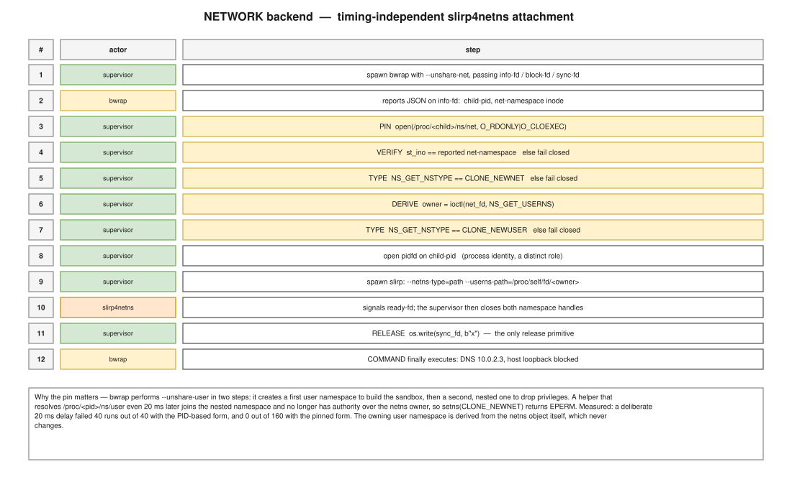

===============
Network backend
===============

The sandbox always starts with ``--unshare-net`` and therefore with no network
at all.  When the ``network`` capability is granted, connectivity is provided
by attaching ``slirp4netns`` to that private namespace — a user-mode network
stack, no root, no bridge, no host interface exposed.

   The attachment sequence.  The highlighted steps are what make it
   independent of timing.

The descriptor protocol
=======================

Four descriptors coordinate a sandbox that must not start until the network is
ready.

.. list-table::
   :header-rows: 1
   :widths: 20 20 60

   * - Descriptor
     - Flag
     - Role
   * - ``info_write``
     - ``--info-fd``
     - bwrap writes namespace JSON here: ``child-pid``, ``net-namespace`` inode
       and the other namespace inodes.
   * - ``block_read``
     - ``--block-fd``
     - The sandboxed command blocks reading this until released.
   * - ``release_write``
     - ``--sync-fd``
     - bwrap holds its own copy of the writer.
   * - ``ready_write`` / ``exit_read``
     - slirp ``--ready-fd`` / ``--exit-fd``
     - The helper signals readiness; closing the exit descriptor asks it to
       terminate.

The ``--sync-fd`` subtlety
--------------------------

``--sync-fd`` is given the *write* end of the block pipe, and bwrap keeps that
copy open.  This is what makes the release primitive unforgeable: if the
supervisor merely closed its own writer, the reader would **not** see EOF,
because bwrap still holds a writer.

The consequence is exactly the property we want:

.. code-block:: python

   os.write(release_write, b"x")     # the ONLY thing that releases the command

Dropping the supervisor's writer without writing does not release anything.
There is a test for precisely that, comparing the behaviour with and without
the release write.

The race this design removes
============================

The obvious implementation — hand ``slirp4netns`` the child PID and let it
resolve ``/proc/<pid>/ns/net`` itself — works, and then stops working under
load, in a way that is very hard to attribute.

What ``strace`` shows the helper doing:

.. code-block:: text

   openat("/proc/<child>/ns/net", O_RDONLY) = 6
   openat("/proc/<child>/ns/user", O_RDONLY) = 7
   setns(7, CLONE_NEWUSER)  = 0
   setns(6, CLONE_NEWNET)   = -1 EPERM (Operation not permitted)

It joins the child's *current* user namespace, then the network namespace.
That is fine — for a few milliseconds.  ``bwrap`` performs ``--unshare-user``
in two steps: a first user namespace to build the sandbox, then a **second,
nested** one to drop privileges.  Measured on the child:

.. code-block:: text

   t=0 ms    ns/user -> user:[4026532425]   ns/net -> net:[4026533044]
   t=50 ms   ns/user -> user:[4026533847]   ns/net -> net:[4026533044]   (unchanged)

Once the child is in the inner user namespace, a helper that joins it no longer
has ``CAP_SYS_ADMIN`` over the user namespace that *owns* the network
namespace, and ``setns(CLONE_NEWNET)`` returns ``EPERM``.  The network
namespace itself never changed.

Measured, 40 iterations per arm:

.. list-table::
   :header-rows: 1
   :widths: 46 27 27

   * - Arm
     - PID-based
     - Pinned
   * - no injected delay
     - 40/40 ok
     - 40/40 ok
   * - 20 ms delay before spawning the helper
     - **0/40**
     - **40/40**
   * - 50 ms delay
     - **0/40**
     - **40/40**
   * - 200 ms delay
     - —
     - 40/40
   * - 50 ms delay under concurrent CPU load
     - —
     - 40/40

The usable window with the PID-based form is a few milliseconds.  Anything
added inside it — instrumentation, logging, an audit write, a systemd call —
breaks the network path outright and deterministically.

The pinned attachment
=====================

The moment the info-fd JSON is parsed, and **before** the pidfd, before any
logging, audit, cgroup inspection or other subprocess:

.. code-block:: python

   namespace_net_fd = os.open(f"/proc/{child_pid}/ns/net", os.O_RDONLY | os.O_CLOEXEC)
   if os.stat(namespace_net_fd).st_ino != reported_netns:
       raise ValueError("pinned network namespace does not match namespace info")
   if fcntl.ioctl(namespace_net_fd, NS_GET_NSTYPE) != CLONE_NEWNET:
       raise ValueError("pinned namespace is not a network namespace")
   namespace_user_fd = fcntl.ioctl(namespace_net_fd, NS_GET_USERNS)
   if fcntl.ioctl(namespace_user_fd, NS_GET_NSTYPE) != CLONE_NEWUSER:
       raise ValueError("owning namespace is not a user namespace")
   sandbox_child_pidfd = os.pidfd_open(sandbox_child_pid)

Three properties make this timing-independent:

**The netns inode is stable and verified.**
   It never changes for the life of the sandbox, and it is cross-checked
   against the inode ``bwrap`` itself reported.  A wrong pin is *detected*,
   not hoped against.

**The owner is derived from the object, not from /proc.**
   ``NS_GET_USERNS`` on the network namespace descriptor returns the user
   namespace that owns it.  That relationship is a property of the namespace
   object; it cannot drift while the child re-parents itself:

   .. code-block:: text

      ioctl(NS_GET_USERNS)   -> user:[4026533791]   (NS_GET_OWNER_UID = 1000)
      after 100 ms:
        child ns/user        -> user:[4026533908]   the nested one
        ioctl userns         -> user:[4026533791]   unchanged

**The types are checked.**
   ``NS_GET_NSTYPE`` confirms ``CLONE_NEWNET`` (``0x40000000``) and
   ``CLONE_NEWUSER`` (``0x10000000``) before either handle is handed to the
   helper.

The helper is then invoked with paths that refer to the pinned descriptors
rather than to any PID:

.. code-block:: text

   slirp4netns --configure --disable-host-loopback
               --netns-type=path
               --userns-path=/proc/self/fd/<owner_fd>
               --ready-fd <R> --exit-fd <E>
               /proc/self/fd/<net_fd>
               tap0

   pass_fds = (ready_write, exit_read, namespace_net_fd, namespace_user_fd)

The user namespace is not optional
----------------------------------

Tested explicitly: with ``--netns-type=path`` but **no** ``--userns-path``, the
helper skips the user namespace and calls ``setns(CLONE_NEWNET)`` directly —
which fails with ``EPERM``.  The supervisor cannot enter the sandbox network
namespace from the initial user namespace.  Both handles are required.

Helper requirements
===================

``--netns-type`` and ``--userns-path`` are probed once per sandbox instance by
parsing ``slirp4netns --help``, outside the critical window.  A helper that does
not advertise both makes the ``network`` capability unavailable:

.. code-block:: text

   slirp4netns network backend unavailable:
   pinned namespace attachment requires --netns-type and --userns-path

There is deliberately **no fallback** to the PID-based form.  Local version at
the time of writing: ``slirp4netns 1.2.1`` (libslirp 4.7.0), which supports
``--netns-type=[path|pid]`` and ``--userns-path``.  It has no ``tapfd`` mode.

Retries are not a fix
=====================

None are used, and none would work.  Once the child has moved into the second
user namespace, re-running the helper against the same PID does not restore
the earlier namespace — it re-observes the wrong one.  The correction removes
the temporal dependency rather than papering over it, and
``network_ready_timeout_seconds`` was **not** increased.

Descriptor hygiene
==================

The namespace handles are opened ``O_CLOEXEC`` and reach exactly one process:
the helper, via ``pass_fds``.

They cannot reach the command, structurally: ``bwrap`` is spawned *before* they
are opened, so there is nothing to inherit.  Verified from inside the sandbox —
the command's descriptor table is ``0``, ``1``, ``2`` (plus whatever it opens
itself), with no ``net:[…]`` or ``user:[…]`` entry.

They are closed as soon as the helper signals ready, and again in the
``finally`` block.  Twenty consecutive network runs leave the supervisor's
descriptor count unchanged.

What the sandbox sees
=====================

.. code-block:: text

   DNS       10.0.2.3         (slirp's resolver, via a generated resolv.conf)
   gateway   10.0.2.2         but --disable-host-loopback blocks host loopback
   address   10.0.2.100/24    on tap0
   TLS       /etc/ssl/certs/ca-certificates.crt, read-only bind

Confirmed from inside the sandbox:

.. code-block:: text

   DNS       : 172.66.147.243
   TLS       : 200
   HOST-LOOP : blocked (OSError)

Failure before release
======================

If anything in the setup fails — helper absent, options unsupported, inode
mismatch, wrong namespace type, ``ioctl`` refused, scope creation refused — the
release write never happens and the command stays blocked forever on its
``block-fd``.  The cleanup path then kills the namespace child through its
pidfd, terminates the scope, stops the helper and closes every descriptor.

If the child's termination cannot be confirmed, the backend is poisoned for the
lifetime of the sandbox object (see :doc:`tool_harness`).
