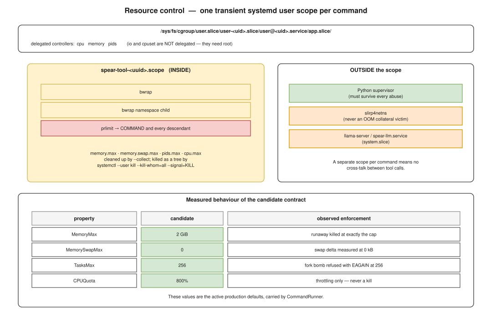

================
Resource control
================

   One transient scope per command; the supervisor and the helpers stay
   outside it.

Two contracts, not one
======================

``ResourceLimits`` and ``CgroupLimits`` are orthogonal and neither replaces the
other.

.. list-table::
   :header-rows: 1
   :widths: 26 37 37

   * -
     - ``ResourceLimits``
     - ``CgroupLimits``
   * - Mechanism
     - ``prlimit`` inside bwrap
     - cgroup v2 via a transient systemd scope
   * - Granularity
     - **per process**
     - **whole tree**
   * - Bounds
     - descriptors, core size
     - memory, task count, CPU
   * - Enforcement
     - the kernel, per-process rlimits
     - the kernel, per-cgroup

A per-process descriptor limit says nothing about a thousand processes each
opening four thousand descriptors.  A cgroup memory limit says nothing about a
single process exhausting its descriptor table.  Both are needed.

.. admonition:: Deliberately not used
   :class: warning

   ``RLIMIT_NPROC`` is **not** a substitute for ``pids.max``: it is per-*user*,
   not per-tree, so it would be shared with the supervisor and with every
   other process the user is running.

   ``RLIMIT_AS`` is **not** a substitute for ``memory.max``: it caps virtual
   address space, which modern allocators and any mmap-heavy tool reserve far
   in excess of what they touch.

   ``io`` and ``cpuset`` are out of scope: they are not delegated to a regular
   user session.

The contract
============

.. code-block:: python

   @dataclass(frozen=True)
   class CgroupLimits:
       memory_max_bytes: int | None = None        # None or >= 1
       memory_swap_max_bytes: int | None = None   # None or >= 0
       tasks_max: int | None = None               # None or >= 1
       cpu_quota_percent: int | None = None       # None or >= 1

A bare ``CgroupLimits()`` is *inactive* — every field ``None``, no wrapper, no
systemd.  The production contract is the populated
``DEFAULT_CGROUP_LIMITS`` shown below.

``bool`` is rejected explicitly on every field: ``type(value) is not int``
catches it, because ``True`` would otherwise silently become ``1``.

Swap is **not** implied by ``memory_max_bytes``.  Coupling the two is a policy
decision, so the mechanism keeps both knobs independent and independently
testable:

.. code-block:: python

   CgroupLimits(memory_max_bytes=1024).systemd_properties()
   # ['MemoryMax=1024']            — no MemorySwapMax

Only the controllers the active fields need are required:
``memory_*`` → ``memory``, ``tasks_max`` → ``pids``,
``cpu_quota_percent`` → ``cpu``.  A memory-only contract does not demand the
``cpu`` controller.

The transient scope
===================

One scope per sandboxed command, named from a UUID only:

.. code-block:: text

   /usr/bin/systemd-run --user --scope --quiet --collect
       --unit=edgem-tool-<uuid4 hex>.scope
       -p MemoryMax=…  -p MemorySwapMax=…  -p TasksMax=…  -p CPUQuota=…%
       -- /usr/bin/bwrap … /usr/bin/prlimit … -- COMMAND

An inactive contract produces the bwrap argv **unchanged** — no wrapper, no
``systemd-run``, no behavioural difference at all.

Why ``--scope`` and not a service
---------------------------------

``systemd-run --user --scope`` **execs in place**.  The measured consequence:

.. code-block:: text

   Popen pid   = 1527306
   inner pid   = 1527306        identical

So the ``Popen`` handle still refers to ``bwrap``; ``--die-with-parent`` still
anchors to the supervisor; inherited descriptors keep their numbers (fd 4
stays fd 4); and the exit code propagates untouched (``exit 7`` → ``rc=7``).
Nothing in the existing process model had to change.

Why ``--collect``
-----------------

Without it, a failed or OOM-killed scope lingers in ``failed`` state and the
units accumulate.  With it, units are released as soon as they finish.
Verified after ``exit 7``, after an OOM kill and after a forced stop: zero
residual ``edgem-tool-*`` units.  No ``reset-failed`` sweep is needed.

Availability and the user bus
=============================

.. code-block:: python

   class CgroupAvailability(StrEnum):
       UNKNOWN, AVAILABLE, SYSTEMD_RUN_ABSENT, SYSTEMCTL_ABSENT,
       USER_BUS_UNAVAILABLE, CONTROLLERS_UNAVAILABLE, REFUSED

Detection reads no secret: it checks that ``systemd-run`` and ``systemctl``
exist and are executable, that ``$XDG_RUNTIME_DIR`` is a directory, that
``…/bus`` **is a socket** (``S_ISSOCK`` — the socket is never connected to or
read), and that the required controllers are delegated.

The supervisor environment
--------------------------

The harness historically launched bwrap with ``env={}``.  ``systemd-run --user``
cannot reach the user bus that way:

.. code-block:: text

   env={}                          → exit 1, "Failed to connect to bus: No medium found"
   XDG_RUNTIME_DIR only            → exit 0

So exactly one variable is passed, and only to ``systemd-run``:

.. code-block:: python

   def supervisor_env(self):
       return {"XDG_RUNTIME_DIR": f"/run/user/{os.getuid()}"}

Because ``bwrap`` applies ``--clearenv``, this cannot reach the command.  The
tests assert both halves: the scoped ``Popen`` receives that environment, the
unscoped one receives ``{}``, and ``--clearenv`` is present either way.

.. note::

   ``loginctl enable-linger`` is never invoked.  Without a user bus — a
   non-interactive ssh session or a cron job on a machine without lingering —
   the harness fails closed.  Enabling lingering is a deployment decision, not
   something a tool runtime should do to the host.

Delegation on this machine
==========================

.. code-block:: console

   $ cat /sys/fs/cgroup/user.slice/user-1000.slice/user@1000.service/cgroup.controllers
   cpu memory pids

   $ systemctl show user@1000.service -p Delegate -p DelegateControllers
   Delegate=yes
   DelegateControllers=cpu memory pids

Exactly the three controllers the contract needs.  ``io`` and ``cpuset`` are
not delegated, which is why they are out of scope rather than merely unused.

Termination
===========

Forced termination targets the unit by its unique generated name:

.. code-block:: python

   subprocess.run([systemctl, "--user", "kill", "--kill-whom=all",
                   "--signal=KILL", unit],
                  timeout=5, shell=False)

Measured against the alternative:

.. list-table::
   :header-rows: 1
   :widths: 40 30 30

   * -
     - ``kill --kill-whom=all``
     - ``stop``
   * - latency
     - **0.007 s**
     - 0.038 s
   * - bwrap return code
     - -9
     - -15
   * - cgroup afterwards
     - gone
     - gone
   * - unit afterwards
     - collected
     - collected
   * - sibling helper
     - untouched
     - untouched

Both work; ``kill`` is faster and unambiguous, so it is what the timeout path
uses.  No numeric PID tree walking is involved, and the unique unit name means
there is no reuse race.

.. note::

   Direct writes to ``cgroup.kill`` *are* permitted on a systemd-managed scope
   — this was tested, and it works.  The harness does not use it anyway:
   letting systemd own the unit lifecycle keeps ``--collect`` in play and
   avoids hand-building cgroup paths.

Calibration
===========

Measured on this machine (62.25 GiB RAM, 22 CPUs, 2 GiB swap), three
repetitions each, under a deliberately non-constraining contract.

.. list-table::
   :header-rows: 1
   :widths: 30 22 26 12 10

   * - Workload
     - wall min/med/max (s)
     - memory.peak (MiB)
     - pids.peak
     - CPU
   * - read-only find + grep
     - 0.03 / 0.04 / 0.05
     - 3.0 / 3.2 / 3.3
     - 5
     - n/a
   * - python unittest
     - 0.19 / 0.20 / 0.22
     - 77.5 / 77.6 / 78.2
     - 3
     - n/a
   * - python CPU + alloc
     - 0.46 / 0.51 / 0.53
     - 143.1 / 143.6 / 143.6
     - 3
     - n/a
   * - make -j1
     - 4.15 / 4.20 / 4.23
     - 29.6 / 30.1 / 52.3
     - 6
     - n/a
   * - make -j2
     - 2.31 / 2.32 / 2.55
     - 54.2 / 54.6 / 55.3
     - 7
     - n/a
   * - **make -j22**
     - 0.69 / 0.70 / 0.71
     - **496.2 / 512.9 / 517.9**
     - **47**
     - n/a
   * - shell pipeline
     - 0.04 / 0.05 / 0.05
     - 10.2 / 10.4 / 10.4
     - 9
     - n/a
   * - git init/add/commit/diff
     - 0.05 / 0.05 / 0.06
     - 3.4 / 3.6 / 3.8
     - 5
     - n/a

.. note::

   ``nr_periods``, ``nr_throttled`` and ``throttled_usec`` only exist once
   ``cpu.max`` is set.  In the unlimited arms they are structurally absent,
   not missing measurements — hence ``n/a`` rather than zero.

CPU quota grid
--------------

``make -j22``, the most parallel workload:

.. list-table::
   :header-rows: 1
   :widths: 18 26 18 12 12 14

   * - CPUQuota
     - wall min/med/max (s)
     - slowdown
     - periods
     - throttled
     - throttled_usec
   * - unlimited
     - 0.75 / 0.75 / 0.76
     - 1.00×
     - n/a
     - n/a
     - n/a
   * - 200 %
     - 4.77 / 4.80 / 4.99
     - **6.36×**
     - 48
     - 47
     - 76 323 725
   * - 400 %
     - 2.33 / 2.37 / 2.53
     - 3.14×
     - 23
     - 22
     - 34 075 797
   * - **800 %**
     - 1.32 / **1.34** / 1.37
     - **1.77×**
     - 13
     - 11
     - 12 428 460

``make -j2`` shows **zero** throttled periods at 400 % and 800 %, and a
single-threaded Python workload is untouched at every quota.

Production defaults
===================

These are **active**.  ``CommandRunner`` carries them, so every command
``rag_chat`` runs is scoped:

.. code-block:: python

   DEFAULT_CGROUP_LIMITS = CgroupLimits(
       memory_max_bytes      = 2_147_483_648,   # 2 GiB — 4.1x the 518 MiB peak
       memory_swap_max_bytes = 0,               # measured swap delta: 0 kB
       tasks_max             = 256,             # 5.4x the observed peak of 47
       cpu_quota_percent     = 800,             # no throttling except a massive build
   )

Ownership: the contract belongs to ``CommandRunner``, not to the sandbox.
``BubblewrapSandbox.run()`` called without an explicit ``cgroup_limits``
applies **none** — it is a mechanism, and keeping it that way is what lets
preflight and the test suite run without a systemd user bus.  The production
path is ``rag_chat`` → ``CommandRunner.run_sandboxed()`` → ``sandbox.run(…,
cgroup_limits=self.cgroup_limits)``.

Observed on the live cgroup of a scoped production command:

.. code-block:: text

   memory.max        = 2147483648
   memory.swap.max   = 0
   pids.max          = 256
   cpu.max           = 800000 100000

.. note::

   The values converge a few tens of milliseconds after ``Popen`` returns:
   ``systemd-run`` is exec'd immediately, the scope is created over D-Bus, and
   the cgroup files exist with their default (``max``) values in between.  Any
   instrumentation that reads them once, early, will see ``max`` and conclude
   the limits are not applied.  Poll until they converge.

   The workload itself is never in that window — ``systemd-run`` completes the
   scope job before exec'ing ``bwrap``, and the adversarial results below are
   the empirical proof: the runaway is killed at exactly the cap.

Enforcement of that combined contract, measured:

.. list-table::
   :header-rows: 1
   :widths: 34 66

   * - Attack
     - Result
   * - allocate 8 GiB
     - killed at exactly the 2048 MiB cap; swap delta 0 kB; ``NO KILL`` never
       printed
   * - fork 2000 processes
     - refused at ``pids.peak = 256`` with ``EAGAIN``; exit 254
   * - 44 concurrent CPU loops
     - **throttled only** — ``nr_throttled = 33/35``,
       ``throttled_usec = 39 686 231`` — never killed

In all three the supervisor survived, ``llama-server`` was untouched in
``system.slice``, and no residual scope remained.

All of the above was re-verified through the production path after activation,
with no limits passed by hand.

Portability
===========

.. list-table::
   :header-rows: 1
   :widths: 26 18 56

   * - Value
     - Portable?
     - Why
   * - ``memory_swap_max_bytes=0``
     - **yes**
     - depends on no host resource
   * - ``memory_max_bytes=2 GiB``
     - reasonably
     - 3 % of RAM here; 50 % of a 4 GiB machine — permissive in relative terms
       but still protective in absolute ones
   * - ``tasks_max=256``
     - **fragile**
     - the peak tracks ``nproc``: 47 for ``make -j22``.  On a 192-thread host,
       ``make -j192`` would exceed it
   * - ``cpu_quota_percent=800``
     - **fragile**
     - 36 % of this machine; 100 % of an 8-core one (no real cap at all); 4 %
       of a 192-thread host

Fixed defaults are recommended anyway: they are simpler, deterministic in
tests, and correct on the only deployment host today.  A host-relative policy
(``min(nproc, 8) * 100 %``, ``nproc * 12`` tasks, ``MemTotal / 32``) would be
fairer across a heterogeneous fleet, at the cost of putting environment
dependence into a security path.  The condition that should trigger that
change is SPEAR running on a many-core host.
