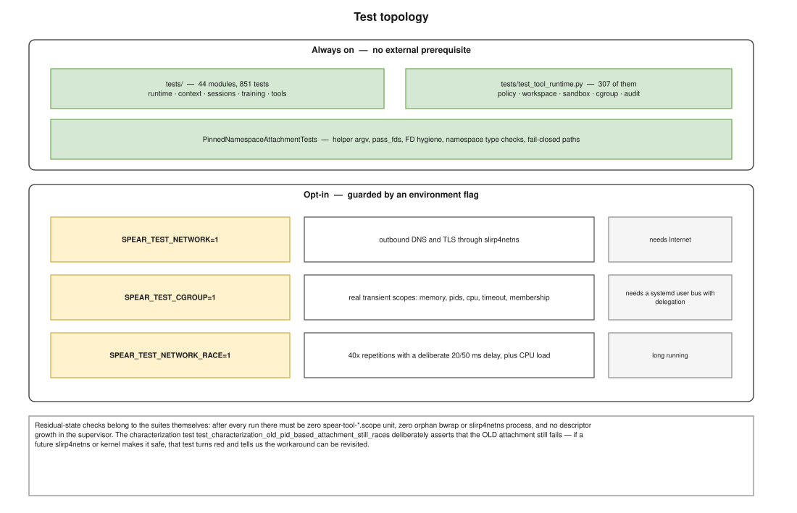

=======
Testing
=======

   Always-on suites, opt-in suites, and what each one needs.

Running the suites
==================

Everything uses the application's own virtualenv:

.. code-block:: console

   $ cd /opt/llm/spear/spear

   $ ./bin/python -m py_compile model_backend.py agent_runtime.py task_controller.py rag_chat.py tool_runtime.py
   $ PYTHONPATH=. ./bin/python -m unittest discover -s tests -p "test_*.py"
   Ran 851 tests — OK (skipped=13)

The discovery command is authoritative.  Forty-four modules, 851 tests, under
forty seconds.  It covers the runtime, context,
memory, sessions, planning/delegation, Explorer, Reviewer, verification,
checkpoints, tool architecture and security substrate with scripted backends;
it does not require a real model API.

The skips are the opt-in suites below.  A checkout with no Internet, no
systemd user bus and no patience still runs the full always-on set.

Opt-in suites
=============

.. list-table::
   :header-rows: 1
   :widths: 32 40 28

   * - Flag
     - What it exercises
     - Requires
   * - ``SPEAR_TEST_NETWORK=1``
     - outbound DNS and TLS through slirp4netns
     - Internet access
   * - ``SPEAR_TEST_CGROUP=1``
     - real transient scopes: memory, pids, cpu, timeout cleanup, membership
     - a systemd user bus with cpu/memory/pids delegation
   * - ``SPEAR_TEST_NETWORK_RACE=1``
     - 40 repetitions per arm with injected delays, plus a CPU-load arm
     - a few minutes

.. code-block:: console

   $ SPEAR_TEST_NETWORK=1     ./bin/python -m unittest tests.test_tool_runtime.Slirp4netnsNetworkTests
   Ran 29 tests — OK
   $ SPEAR_TEST_CGROUP=1      ./bin/python -m unittest tests.test_tool_runtime.OptInRealCgroupTests
   Ran 6 tests — OK
   $ SPEAR_TEST_NETWORK_RACE=1 ./bin/python -m unittest tests.test_tool_runtime.OptInNetworkRaceTests
   Ran 4 tests — OK

What the suites assert
======================

Negative properties
-------------------

Much of the value is in asserting that things **do not** happen.  These are
easy to satisfy by accident with a test that only checks a return status, so
they are checked at the mechanism level instead:

* ``popen.assert_not_called()`` — a fail-closed decision spawned nothing;
* ``self.assertEqual(writes, [])`` — no release write followed a setup
  failure, i.e. the sandboxed command never started;
* the marker file the command would have created does not exist;
* the supervisor's descriptor count did not grow;
* no residual ``edgem-tool-*`` unit, no orphan ``bwrap`` or ``slirp4netns``.

Descriptor and namespace hygiene
--------------------------------

``PinnedNamespaceAttachmentTests`` is always on and fast (~0.2 s).  It checks
the helper argv and its exact ``pass_fds``, that the command's descriptor table
contains no namespace handle, that the supervisor leaks nothing on success, on
setup failure or on a Python exception, and that both fail-closed paths — an
incapable helper, and an inode mismatch — refuse without releasing.

The characterization test
-------------------------

``test_characterization_old_pid_based_attachment_still_races`` deliberately
asserts that the **old** PID-based attachment *still fails* (10 out of 10 with
a 20 ms delay).

That looks backwards until you consider what it protects.  The pinned
attachment exists to work around a real interaction between bwrap's two-step
user namespace and slirp4netns.  If a future kernel or helper made the simple
form safe, this test turns red — and tells us the workaround can be revisited
— instead of leaving a permanent unexplained complication in the code.

Determinism
===========

The always-on suites are deterministic.  One property required care:

.. admonition:: Do not instrument the critical window
   :class: warning

   Any synchronous work between reading bwrap's info-fd and spawning the
   network helper breaks the network path (:doc:`network`).  A test that wants
   to observe the live scope must sample from a **side thread**, and that
   thread must be cheap — an early version scanned all of ``/proc`` every
   10 ms and made the suite flaky through GIL contention alone.

   ``OptInRealCgroupTests`` samples via ``/proc/self/task/*/children`` rather
   than a full ``/proc`` walk, and stops the watcher between attempts.

A second, pre-existing property is worth knowing: under heavy artificial CPU
load the network suites can still hit ``slirp4netns failed to become ready``,
because the readiness wait is a wall-clock timeout.  That is a property of the
timeout, not of the attachment.

Residual state
==============

After a full run, all four must hold:

.. code-block:: console

   $ systemctl --user list-units --all 'edgem-tool-*' --no-legend | wc -l
   0
   $ pgrep -a bwrap ; pgrep -a slirp4netns
   (nothing)
   $ ls /sys/fs/cgroup/user.slice/user-*.slice/user@*.service/app.slice/edgem-tool-* 2>/dev/null
   (nothing)

and the supervisor's descriptor count is unchanged across repeated runs.

.. note::

   Orphan ``bwrap`` processes observed during development came from ad-hoc
   diagnostic scripts that killed ``bwrap`` without going through the pidfd
   sequence — not from the runtime.  They are recognisable by their workspace
   path: the runtime always uses a ``/tmp/edgem-slirp-`` prefix.

Live smoke test
===============

The end-to-end check that serving and the backend contract are both healthy is
in :doc:`model_serving`; the expected answer is ``end_turn`` /
``EDGEM-BACKEND-OK`` / empty tool tuple.
