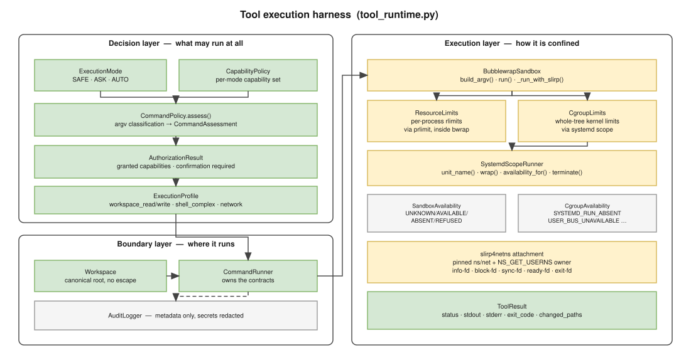

======================
Tool execution harness
======================

``tool_runtime.py`` is the security and command-execution substrate.  The
provider-neutral lifecycle above it is split between ``ToolRegistry``,
``ToolRouter``, ``AgentRuntime`` and ``TaskController``; none imports
``rag_chat``.  The substrate remains independently testable.

.. _the-web-pair:

The web pair
============

``search_internet`` finds pages; ``fetch_url`` reads one, or saves it with
``save_as``.  Both run in the chat process rather than the sandboxed shell, so
reading works in ``SAFE``; saving is a mutation and takes the ordinary write
authorization.  A long PDF comes back in slices and each names the ``pages``
range that continues it — told only that the answer was truncated, a model
re-fetches the same url.

Their exposure follows ``web_enabled`` alone.  It used to depend on matching
the objective against ``\b(web|internet|online|latest|current release)\b``,
which withheld both tools whenever the phrasing missed — "please get the
complete Code-G pdf" matched nothing, and so did a bare ``fetch https://…``.
The two schemas that gate saved measure 155 tokens of a 65536-token window; a
tool the model cannot see is one it narrates instead of using.

   The three layers of ``tool_runtime.py``: what may run, where it runs, how
   it is confined.

Three layers
============

The module is organised as three layers with a one-way dependency: the
decision layer never knows how confinement works, and the execution layer
never knows why a command was allowed.

Decision layer — *what may run at all*
--------------------------------------

.. list-table::
   :header-rows: 1
   :widths: 30 70

   * - Type
     - Role
   * - ``ExecutionMode``
     - ``SAFE`` · ``ASK`` · ``AUTO``.
   * - ``CapabilityPolicy``
     - Immutable per-mode capability set.  ``for_mode()`` is the only way to
       ask what a mode grants.
   * - ``CommandPolicy.assess()``
     - Classifies an argv into a ``CommandAssessment``:
       ``READ_ONLY``, ``WORKSPACE_MUTATING``, ``SHELL_COMPLEX`` or
       ``DANGEROUS``.
   * - ``AuthorizationResult``
     - The outcome: granted capabilities, and whether a confirmation is
       required.
   * - ``ExecutionProfile``
     - The pure execution contract derived from granted capabilities:
       ``workspace_read``, ``workspace_write``, ``shell_complex``,
       ``network``, and the not-yet-implemented ``gpu`` / ``ssh`` /
       ``container_runtime`` / ``secrets_allowed``.

Boundary layer — *where it runs*
--------------------------------

``Workspace``
   A canonical root that every filesystem tool path must resolve inside.
   ``resolve()`` rejects traversal, absolute paths (unless explicitly allowed)
   and — importantly — symlink escapes, by resolving the whole path including
   the parent of a not-yet-existing file before checking containment.

``CommandRunner``
   Owns the resource contracts (``resource_limits``, ``cgroup_limits``) and
   the sandbox instance.  This is the ownership boundary: ``rag_chat`` knows
   nothing about ``MemoryMax``, ``TasksMax``, ``CPUQuota``, ``systemd-run`` or
   unit names.

``AuditLogger``
   Append-only, metadata only.  ``KEY=value`` assignments that look like
   secrets are redacted, and leading environment assignments are stripped
   before the executable summary is derived.

Execution layer — *how it is confined*
--------------------------------------

``BubblewrapSandbox``
   ``build_argv()`` composes the structured bwrap argv; ``run()`` executes the
   closed-network path; ``_run_with_slirp()`` executes the network path.

``ResourceLimits`` / ``CgroupLimits``
   Two orthogonal resource contracts.  See :doc:`resource_control` for why
   there are two and why neither replaces the other.

``SystemdScopeRunner``
   Knows systemd and nothing else.  Given an argv and a ``CgroupLimits`` it
   produces a wrapped argv; it has no idea what a capability is.

``ToolResult``
   The single result type: ``status``, ``stdout``, ``stderr``, ``exit_code``,
   ``changed_paths``.  ``status`` is one of ``ok``, ``denied``, ``cancelled``,
   ``invalid_path``, ``not_found``, ``timeout``, ``failed``.

Life of a tool call
===================

#. ``ToolExposurePolicy`` supplies the role's model-visible registry view.
#. The model proposes a tool call and ``ToolRouter`` validates its schema.
#. The router invokes the registered handler and observer hooks.
#. ``CommandPolicy.assess()`` classifies the argv.
#. The classification is intersected with the capabilities the current mode
   grants.  Anything not granted ends here.
#. In ``ASK`` mode a confirmation is requested for mutating or network work.
#. ``CommandRunner.ensure_sandbox()`` preflights Bubblewrap — once, cached —
   and for network work also preflights the full slirp path.
#. ``BubblewrapSandbox.run()`` checks, **before spawning anything**:
   the bwrap binary, ``prlimit`` if resource limits are active, the cgroup
   mechanism if cgroup limits are active, and for network work the slirp
   helper plus its pinned-namespace support.
#. The command runs, wrapped as described in :doc:`sandbox`.
#. The substrate returns a ``ToolResult``; the router normalizes it as a
   ``ToolResultEnvelope``.
#. Large safe output is kept in ``ResultStore`` while only a bounded preview is
   rendered into model context.
#. Grounded mutations update ``WorkingState`` and mutating attempts are
   recorded by ``AuditLogger``.

Every one of the step-6 checks returns a ``failed`` ``ToolResult`` rather than
proceeding in a degraded mode.  There is no code path from "mechanism
unavailable" to "run it anyway".

Once the sandbox is known to be down
====================================

The checks above decide one command at a time.  One conclusion outlives the
command that reached it: when a command's output reports the sandbox missing,
``_registered_command`` records it on the turn's cache, and every later
``edit_file``, ``write_file`` or ``append_file`` in that turn returns
``DENIED`` with an explicit refusal instead of writing.

The reason is not sandbox purity but verifiability.  Without the sandbox
nothing the model writes can be read back, compiled or run, so an edit made
from retrieved context alone is a change nobody can check — and the answer the
user needs is that the sandbox is down, not a plausible patch.  ``DENIED`` and
not ``FAILED``: the tool did not break, it declined.

The guard predates the router and was carried across it deliberately.  Keeping
"our side" of that merge would have dropped it silently, since the monolithic
``execute_tool`` it lived in no longer exists.

Preflight caching
=================

Preflight runs a real, minimal sandbox rather than probing version strings —
it executes a small ``/bin/sh`` that asserts ``$PWD``, workspace writability,
``$HOME`` and ``$TMPDIR``.  Probing what the kernel actually permits is the
only honest test; a version number does not tell you whether unprivileged user
namespaces are enabled.

Results are cached on the sandbox instance, and terminal failures
(``ABSENT``, ``INEXECUTABLE``, ``REFUSED``) are remembered so a broken
environment is not re-probed on every call.  The network preflight is cached
per (sandbox, workspace) pair and invalidated when either changes.

Containment poisoning
=====================

The network path has one failure mode that must never be retried blindly: the
harness asked the sandbox child to die, and could not confirm that it did.

If ``_wait_pidfd_exit()`` cannot observe the child's termination, the sandbox
sets ``network_containment_failed`` and every subsequent network request is
refused for the lifetime of that sandbox object.  A namespace whose death is
unverified may still hold a network namespace that a helper is attached to;
continuing would mean starting a second helper against unknown state.

Why the pidfd
=============

Every place the harness signals or observes the sandbox child, it does so
through a **pidfd**, never a numeric PID:

.. code-block:: python

   signal.pidfd_send_signal(pidfd, signal.SIGKILL)   # not os.kill(pid, ...)

A numeric PID can be reused between the moment it is read and the moment it is
signalled.  On a machine that spawns processes as fast as a build does, that is
not a theoretical concern.  ``_stop_namespace_child()`` retries once through
the *same* pidfd and has deliberately no ``os.kill`` fallback.

The pidfd and the namespace handles introduced in :doc:`network` have distinct
roles that are worth keeping straight:

.. list-table::
   :header-rows: 1
   :widths: 30 70

   * - Handle
     - Identity it pins
   * - pidfd
     - the *process* — liveness and safe signalling
   * - ``ns/net`` fd, owner userns fd
     - the *namespaces* — stable targets for the network helper

Neither substitutes for the other, and the code does not conflate them.
